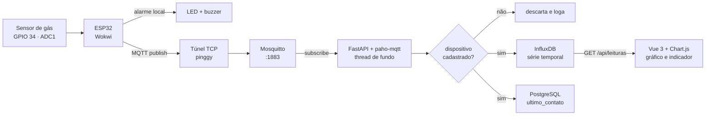

# Gas-Guard

Monitoramento contínuo de vazamento de gás (GLP) em cozinhas residenciais e
de pequeno comércio, com alarme local e histórico na web.

Trabalho da 1ª etapa da disciplina **Desenvolvimento de Software para Web II**
— 3º ano, Engenharia de Software.

---

## O problema

**Quem sofre.** Famílias que cozinham com botijão de GLP e pequenos
estabelecimentos — lanchonetes, padarias, restaurantes de bairro — onde o
botijão fica num canto de serviço, muitas vezes fechado e sem ninguém por
perto durante boa parte do dia.

**O que acontece hoje.** Na esmagadora maioria dessas cozinhas não existe
nenhum sensor. A detecção de vazamento depende de alguém **sentir o cheiro**
do odorizante (mercaptana) adicionado ao gás. Isso falha justamente nas
situações que mais importam:

- o vazamento começa com a casa vazia, ou de madrugada, e o gás se acumula
  por horas sem ninguém para sentir;
- numa cozinha comercial o ambiente já é carregado de odores fortes e a
  equipe está ocupada, então um cheiro fraco passa despercebido;
- o olfato humano se satura: quem fica exposto a uma concentração baixa e
  constante para de perceber o cheiro depois de alguns minutos.

O risco não é linear. O GLP tem **limite inferior de explosividade (LEL) em
torno de 1,9% do volume do ar — cerca de 19.000 ppm**. Abaixo disso a mistura
não entra em combustão; a partir dali, qualquer faísca — o próprio acendedor
do fogão, um interruptor, o compressor da geladeira — basta. Ou seja: durante
todo o período de acúmulo não acontece absolutamente nada, e o dano aparece de
uma vez só. É exatamente o tipo de risco que pessoas vigiam mal e sensores
vigiam bem.

**O que muda com o sistema.** Um sensor de gás instalado perto do ponto de
risco mede a concentração a cada 3 segundos, sem cansar e sem se acostumar:

1. **Alarme local imediato** — LED e buzzer disparam no próprio dispositivo
   ao ultrapassar o limiar, **mesmo com a rede fora**. A segurança física não
   depende de nuvem.
2. **Histórico** — toda leitura vai para um banco de séries temporais. Dá
   para responder "isso já vinha subindo desde ontem?", que é o que separa um
   vazamento lento de um pico momentâneo ao acender o fogão.
3. **Alerta antes do perigo** — o limiar de alarme fica em **2.000 ppm**,
   cerca de **10% do LEL**, com uma faixa intermediária de atenção em
   1.000 ppm. Avisa enquanto ainda é um problema de manutenção, não de
   emergência.
4. **Painel web** — quem administra vê o estado atual e a curva de todos os
   ambientes monitorados de um lugar só.

---

## Fluxo dos dados

O fluxo mínimo exigido pelo enunciado, ponta a ponta:

```
Sensor  ->  MQTT  ->  Mosquitto  ->  Python  ->  InfluxDB  ->  Aplicação Web
```



O diagrama completo da arquitetura, incluindo o que roda em Docker e as
telas de cadastro, está em [`docs/ARCHITECTURE.md`](docs/ARCHITECTURE.MD).

**Contrato da mensagem.** Tópico `gasguard/<codigo>/leitura`, payload
`{"codigo":"ESP32-COZINHA-01","ppm":1834.0}`, cadência de 3 segundos.

O horário **não** vai no payload: quem carimba é o InfluxDB na gravação,
porque o ESP32 simulado não tem relógio confiável. No Influx, `codigo` é
**tag** (indexada, baixa cardinalidade) e `ppm` é **field**.

O backend rejeita leituras de dispositivos que não existem no cadastro. Além
de evitar dados órfãos, isso protege a cardinalidade do índice do InfluxDB —
sem essa checagem, qualquer código inventado criaria uma série nova e
permanente.

---

## Stack

| Camada | Tecnologia | Onde está |
| --- | --- | --- |
| Dispositivo | ESP32 simulado no Wokwi | `firmware/` |
| Comunicação | MQTT (PubSubClient / paho-mqtt) | `firmware/`, `backend/app/mqtt/` |
| Broker | Mosquitto 2.0 | `infra/mosquitto/`, `docker-compose.yml` |
| Backend | Python · FastAPI | `backend/app/` |
| Série temporal | InfluxDB 2.7 | `backend/app/core/influx.py` |
| Cadastro | PostgreSQL 17 · SQLAlchemy 2.0 · Alembic | `backend/app/ambientes/`, `backend/app/dispositivos/` |
| Frontend | Vue 3 + TypeScript + Vite | `frontend/` |
| Visualização | Chart.js via vue-chartjs | `frontend/src/components/` |

O backend é organizado por funcionalidade, em camadas
`router → service → repository`. A regra de negócio fica no *service* porque
a aplicação tem **duas portas de entrada** sobre o mesmo domínio: HTTP
(FastAPI) e MQTT (paho). O callback do MQTT e o endpoint HTTP chamam o mesmo
service.

---

## Como rodar

### Tudo em Docker

**Pré-requisito:** Docker.

```bash
cp .env.example .env          # preencha usuário, senha e token
docker compose up --build -d
```

Sobem cinco containers: Postgres, InfluxDB, Mosquitto, backend e frontend.
O backend roda `alembic upgrade head` sozinho antes de servir, então o banco
já sobe migrado.

| Serviço | URL |
| --- | --- |
| Painel | http://localhost:5173 |
| Ambientes | http://localhost:5173/ambientes |
| Dispositivos | http://localhost:5173/dispositivos |
| API + Swagger | http://localhost:8000/docs |
| InfluxDB | http://localhost:8086 |

Para acompanhar as leituras chegando: `docker compose logs -f backend`.

### Na máquina host (para desenvolver)

Com recarga automática, útil enquanto se mexe no código.

```bash
docker compose up -d postgres influx mosquitto   # só a infraestrutura

cd backend
python -m venv .venv
.venv/Scripts/activate        # Linux/macOS: source .venv/bin/activate
pip install -r requirements.txt
alembic upgrade head
uvicorn app.main:app --reload         # http://localhost:8000/docs

cd frontend                            # noutro terminal
cp .env.example .env
npm install
npm run dev                            # http://localhost:5173
```

As URLs de conexão do `.env` apontam para `localhost`, que é o certo neste
modo. No compose, o serviço `backend` sobrescreve as três por nomes de
serviço (`postgres`, `influx`, `mosquitto`) — dentro da rede do Docker,
`localhost` seria o próprio container.

### O dispositivo

Vale para os dois modos. O Wokwi roda na nuvem e não enxerga o `localhost` da
sua máquina, então o broker precisa ser exposto por um túnel TCP:

```bash
ssh -p 443 -R0:localhost:1883 tcp@a.pinggy.io
```

Copie o host e a porta que o comando imprime para `MQTT_HOST` e `MQTT_PORTA`
em `firmware/src/sketch.ino` e inicie a simulação. O endereço muda a cada
sessão do túnel.

**Cadastre o dispositivo** antes de esperar dados. Pelo painel, em
`http://localhost:5173/ambientes` e depois `/dispositivos`; ou pela API, em
`POST /api/ambientes` e `POST /api/dispositivos`. O `codigo` precisa ser o
mesmo que está no `sketch.ino` (`ESP32-COZINHA-01`) — leituras de códigos não
cadastrados são descartadas de propósito.

---

## Conversão para ppm

A peça `gas-sensor` do Wokwi entrega uma **tensão linear** — ela não modela a
curva Rs/R0 logarítmica de um MQ-2 real. A conversão aplicada no firmware é,
portanto, uma **aproximação linear** sobre a faixa de detecção nominal do MQ-2
(200 a 10.000 ppm):

```
ppm = 200 + (adc / 4095) × (10000 - 200)
```

Com um sensor físico seria necessário calibrar o `R0` em ar limpo e aplicar a
curva do datasheet. A fórmula está em `ppmDeAdc()`, em
`firmware/src/sketch.ino`.

### Faixas de alerta

| Faixa | Concentração | Origem |
| --- | --- | --- |
| Normal | < 1.000 ppm | — |
| Atenção | 1.000 – 1.999 ppm | metade do limiar de alarme |
| Crítico | ≥ 2.000 ppm | ~10% do LEL do GLP (≈ 19.000 ppm) |

O limiar de 2.000 ppm aparece em dois lugares e precisa ser mudado nos dois:
`LIMITE_PPM` em `firmware/src/sketch.ino` (alarme físico) e `LIMITE_CRITICO`
em `frontend/src/api/types.ts` (cor do painel).

---

## API

| Método | Rota | Descrição |
| --- | --- | --- |
| `POST` | `/api/ambientes` | cria ambiente |
| `GET` | `/api/ambientes` | lista ambientes |
| `GET` | `/api/ambientes/{id}` | busca por id |
| `PATCH` | `/api/ambientes/{id}` | edita |
| `DELETE` | `/api/ambientes/{id}` | exclui (409 se tiver dispositivos) |
| `POST` | `/api/dispositivos` | cadastra dispositivo |
| `GET` | `/api/dispositivos` | lista dispositivos |
| `GET` | `/api/dispositivos/{codigo}` | busca por código |
| `PATCH` | `/api/dispositivos/{codigo}` | edita |
| `DELETE` | `/api/dispositivos/{codigo}` | desativa (exclusão lógica) |
| `GET` | `/api/leituras/{codigo}?minutos=60` | histórico da série temporal |

Documentação interativa em `http://localhost:8000/docs`.

---

## Limitações conhecidas

- **O túnel muda de endereço** a cada sessão, obrigando a editar o
  `sketch.ino`. Alternativas avaliadas: bridge do Mosquitto para um broker
  público de endereço fixo, ou túnel pago com endereço reservado.
- **O broker não tem autenticação** (`allow_anonymous true`). Aceitável num
  ambiente local de desenvolvimento; num sistema real seriam necessários
  usuário/senha e TLS.
- **A conversão para ppm é aproximada**, pela razão explicada acima.
- **O `VITE_API_URL` é embutido em tempo de build.** Trocar a URL da API
  exige reconstruir a imagem do frontend (`docker compose build frontend`),
  não basta reiniciar o container.
