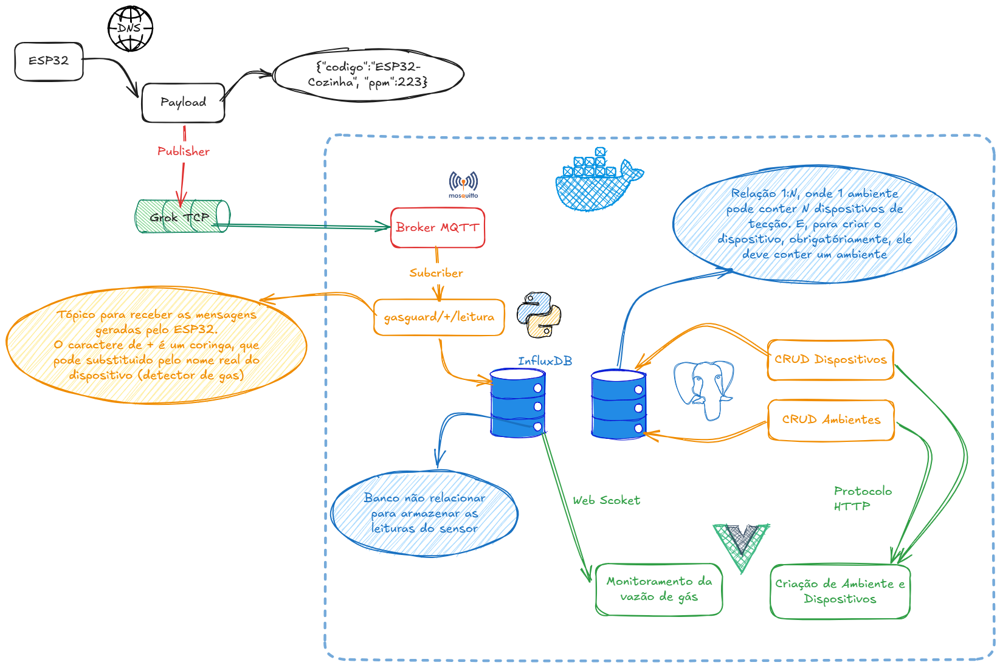

# Arquitetura

## Visao geral



O tracejado azul delimita o que roda em Docker. Fora dele fica so o ESP32,
que e simulado no Wokwi (nuvem) e alcanca o broker por um tunel TCP.

Repare nas duas relacoes que o desenho destaca: um ambiente contem N
dispositivos, e nenhum dispositivo pode ser criado sem um ambiente; e o
coringa `+` do topico, que aceita qualquer codigo de dispositivo naquele
nivel.

Dois pontos em que o desenho e o codigo divergem hoje:

- o painel busca o historico por **HTTP com polling de 5s**, nao por
  WebSocket. Comunicacao bidirecional e item do 2o bimestre;
- o tunel e feito por **SSH via pinggy**, nao por ngrok - o binario do ngrok
  e bloqueado pelo Smart App Control nesta maquina.

## Fluxo obrigatorio da 1a etapa

```
Sensor  ->  MQTT  ->  Mosquitto  ->  Python  ->  InfluxDB  ->  Web
  OK        OK          OK           OK          OK          OK
```

O ESP32 publica em `gasguard/<codigo>/leitura` a cada 3s, com payload
`{"codigo":"...","ppm":1834.0}`. O Mosquitto recebe. O backend assina
`gasguard/+/leitura` numa thread de fundo, valida o payload com Pydantic,
confere o codigo contra o Postgres e grava a leitura no InfluxDB. O Vue
consome o historico por HTTP e desenha grafico e indicador.

Contrato de mensagem: o horario NAO vai no payload, quem carimba e o
InfluxDB na gravacao. A tag do Influx e `codigo`, igual a coluna do
Postgres e ao nivel do meio do topico.

## As duas portas de entrada

O ponto arquitetural que define o projeto: a aplicacao recebe dados por
**duas portas** sobre o mesmo dominio.

```
HTTP  (FastAPI)  ->  router  -\
                               >-  service  ->  repository  ->  banco
MQTT  (paho)     ->  callback -/
```

Por isso a regra de negocio nao pode morar no router. O callback do MQTT
chama `leituras/service.processar_leitura()`, o mesmo lugar onde um
endpoint HTTP chamaria.

Consequencia pratica: o callback roda na thread do paho, fora de qualquer
request. O `get_db()` do FastAPI e uma dependency e so funciona dentro de
uma request; por isso `processar_leitura()` abre a sessao na mao com
`SessionLocal()`, uma por mensagem. Sessao do SQLAlchemy nao e thread-safe
e nao pode ser compartilhada entre as duas portas.

## Estrutura

```
gas-guard
 |- backend
 |   |- alembic
 |   |   |- versions
 |   |   |   \- 21bda3d0d359_cria_ambientes_e_dispositivos.py
 |   |   |- env.py
 |   |   |- README
 |   |   \- script.py.mako
 |   |- app
 |   |   |- ambientes            CRUD completo, em camadas
 |   |   |   |- __init__.py
 |   |   |   |- exceptions.py
 |   |   |   |- models.py
 |   |   |   |- repository.py
 |   |   |   |- router.py
 |   |   |   |- schemas.py
 |   |   |   \- service.py
 |   |   |- core
 |   |   |   |- __init__.py
 |   |   |   |- database.py      SQLAlchemy + sessao por request
 |   |   |   \- influx.py        gravar_leitura() / ler_ultimas_leituras()
 |   |   |- dispositivos         CRUD completo, em camadas
 |   |   |   |- __init__.py
 |   |   |   |- exceptions.py
 |   |   |   |- models.py
 |   |   |   |- repository.py
 |   |   |   |- router.py
 |   |   |   |- schemas.py
 |   |   |   \- service.py
 |   |   |- leituras             serie temporal
 |   |   |   |- __init__.py
 |   |   |   |- repository.py    traduz as tuplas do Influx
 |   |   |   |- router.py        GET /api/leituras/{codigo}
 |   |   |   |- schemas.py       LeituraIn (MQTT) e LeituraOut (API)
 |   |   |   \- service.py       processar_leitura() e listar_historico()
 |   |   |- mqtt
 |   |   |   |- __init__.py
 |   |   |   \- subscriber.py    cliente paho, callbacks, criar_client()
 |   |   |- __init__.py
 |   |   \- main.py              FastAPI, CORS, lifespan do subscriber
 |   |- alembic.ini
 |   |- .dockerignore
 |   |- Dockerfile           python:3.13-slim, migra e serve
 |   |- requirements.txt
 |   \- ruff.toml
 |- docs
 |   |- ARCHITECTURE.MD
 |   |- ARCHITECTURE.png
 |   |- COMANDS.MD               comando do tunel TCP
 |   \- PLAN.MD                  enunciado do professor
 |- firmware                     projeto Wokwi + PlatformIO
 |   |- src
 |   |   \- sketch.ino           ESP32: sensor, ppm, alarme local, publish
 |   |- diagram.json             ESP32 DevKit-C v4, sensor no GPIO 34 (ADC1)
 |   |- libraries.txt            usado pelo wokwi.com
 |   |- platformio.ini           pioarduino (core 3.x) + build_dir ASCII
 |   |- wokwi.toml               aponta para build/ (juncao, nao versionada)
 |   |- sketch.ino.bak           backup pre-millis, pode apagar
 |   \- wokwi-project.txt
 |- frontend                     Vue 3 + TS + Vite
 |   |- public
 |   |   |- favicon.svg
 |   |   \- icons.svg
 |   |- src
 |   |   |- api
 |   |   |   |- client.ts        instancia axios + funcoes tipadas
 |   |   |   \- types.ts         espelho dos schemas + faixas de ppm
 |   |   |- assets
 |   |   |- components
 |   |   |   |- GraficoLeituras.vue    linha de ppm (Chart.js)
 |   |   |   \- IndicadorStatus.vue    faixa atual + resumo do periodo
 |   |   |- router
 |   |   |   \- index.ts
 |   |   |- views
 |   |   |   |- AmbientesView.vue      CRUD de ambientes
 |   |   |   |- DashboardView.vue      painel, polling de 5s
 |   |   |   \- DispositivosView.vue   CRUD de dispositivos
 |   |   |- App.vue
 |   |   |- main.ts
 |   |   |- style.css
 |   |   \- vite-env.d.ts
 |   |- .env / .env.example      VITE_API_URL
 |   |- .dockerignore
 |   |- Dockerfile           multi-stage: node build -> nginx
 |   |- index.html
 |   |- nginx.conf            try_files para o history mode
 |   |- package.json             axios, chart.js, vue-chartjs, pinia, vue-router
 |   |- tsconfig*.json
 |   \- vite.config.ts
 |- infra
 |   |- mosquitto
 |   |   \- config
 |   |       \- mosquitto.conf   listener 1883, allow_anonymous
 |   \- postgres                 (vazia)
 |- .env / .env.example
 |- docker-compose.yml           postgres + influx + mosquitto
 \- README.md                    problema, fluxo, como rodar
```

## Decisoes registradas

**Dispositivo desconhecido e descartado.** `processar_leitura()` confere o
`codigo` contra o Postgres antes de gravar. Motivo: no Influx `codigo` e uma
**tag**, e tag com valores ilimitados explode a cardinalidade do indice. Como
o broker esta com `allow_anonymous true`, qualquer um pode publicar em
`gasguard/QUALQUER-COISA/leitura`; sem a checagem, cada codigo inventado
viraria uma serie nova e permanente.

**A mesma checagem protege a query.** `ler_ultimas_leituras()` monta o Flux
por interpolacao de string. `listar_historico()` valida o codigo no Postgres
ANTES de consultar o Influx, entao um codigo arbitrario nunca chega na query.

**Escrita sincrona no Influx.** `write_api` usa `SYNCHRONOUS` em vez do lote
padrao: cada write vai na hora e levanta excecao se falhar. O padrao em lote
engole erros silenciosamente.

**`enable_logger()` no cliente paho.** Excecao dentro de um callback do paho
e capturada pela biblioteca e nao derruba o processo — mas some sem deixar
rastro. Com o logger ligado, ela aparece no terminal com traceback.

**Exclusao de ambiente e fisica; de dispositivo e logica.** Dispositivo tem
coluna `ativo` e o DELETE apenas a marca como falsa, preservando o historico
no Influx. Ambiente nao tem `ativo`: o DELETE remove de verdade, e recusa com
409 se houver dispositivos apontando para ele.

## Notas

**`firmware/build`** e uma juncao (`mklink /J`) para `C:\pio-build\gasguard\esp32dev`.
O toolchain xtensa nao escreve em caminhos com caracteres nao-ASCII (o "3o ano"
deste repo), entao o PlatformIO gera o binario fora e a juncao o expoe dentro do
workspace, que e onde a extensao do Wokwi exige que ele esteja. Nao e versionada:
quem clonar o repo precisa recria-la.

**Os cinco servicos estao no docker-compose:** postgres, influx, mosquitto,
backend e frontend. `docker compose up --build -d` sobe tudo. Rodar backend e
frontend na maquina host continua funcionando e e o modo recomendado para
desenvolver, por causa do reload.

Tres detalhes que essa configuracao resolve:

1. **Enderecos.** Dentro da rede do compose `localhost` e o proprio container.
   O servico `backend` sobrescreve `DATABASE_URL`, `INFLUX_URL` e `MQTT_HOST`
   com os nomes dos servicos. O `.env` continua com `localhost`, para o modo
   host - o `load_dotenv` nao sobrepoe variavel que ja existe no ambiente,
   entao o compose vence dentro do container.

2. **`VITE_API_URL` e build-time.** O Vite embute o valor no bundle. Quem
   chama a API e o NAVEGADOR, que esta fora da rede do compose - por isso o
   valor e `http://localhost:8000` e nao `http://backend:8000`. Trocar a URL
   exige `docker compose build frontend`.

3. **`connect_async` no paho.** O backend pode subir antes de o Mosquitto
   aceitar conexao. Com `connect()` isso levantaria ConnectionRefusedError
   dentro do lifespan e o container entraria em loop de restart;
   `connect_async()` deixa a thread do loop conectar e reconectar sozinha,
   com backoff de 1s a 30s.

O frontend tem tres rotas: `/` (painel), `/ambientes` e `/dispositivos`, as
duas ultimas com CRUD completo consumindo as mesmas rotas da API. Os erros de
dominio do backend chegam a tela pela `mensagemDeErro()` do `api/client.ts`,
que trata os dois formatos que o FastAPI devolve: `detail` como string (404 e
409) e como lista de objetos (422 da validacao do Pydantic).

O frontend e servido por nginx a partir do build estatico, com `try_files`
apontando para o `index.html`: sem isso, F5 em qualquer rota que nao seja `/`
daria 404 do nginx, porque o vue-router usa history mode e as rotas nao
existem como arquivo.

**Postgres nao e exigido nesta etapa.** O PLAN.MD coloca banco relacional no
2o bimestre. O CRUD existe porque o backend precisa saber quais dispositivos
sao validos, mas nao pontua na 1a entrega.

**O limiar de 2000 ppm esta duplicado** entre `firmware/src/sketch.ino`
(`LIMITE_PPM`, alarme fisico) e `frontend/src/api/types.ts`
(`LIMITE_CRITICO`, cor do painel). Mudar um exige mudar o outro. Unificar
exigiria o firmware buscar configuracao pela rede, o que nao compensa agora.
